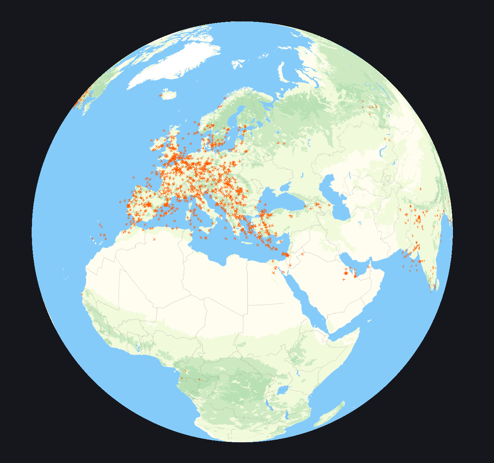
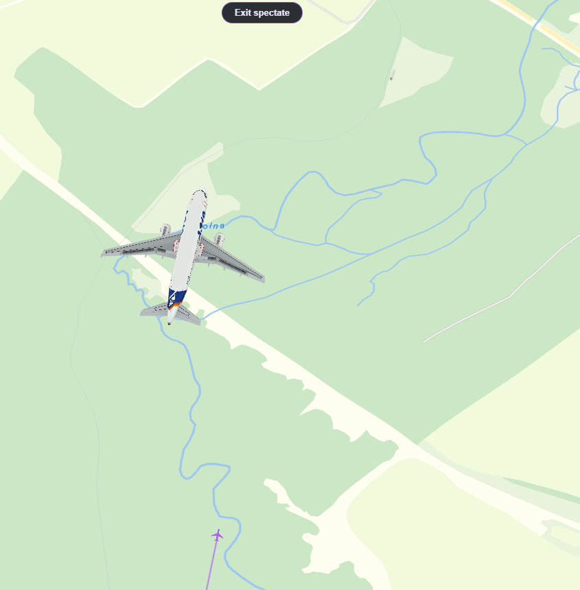
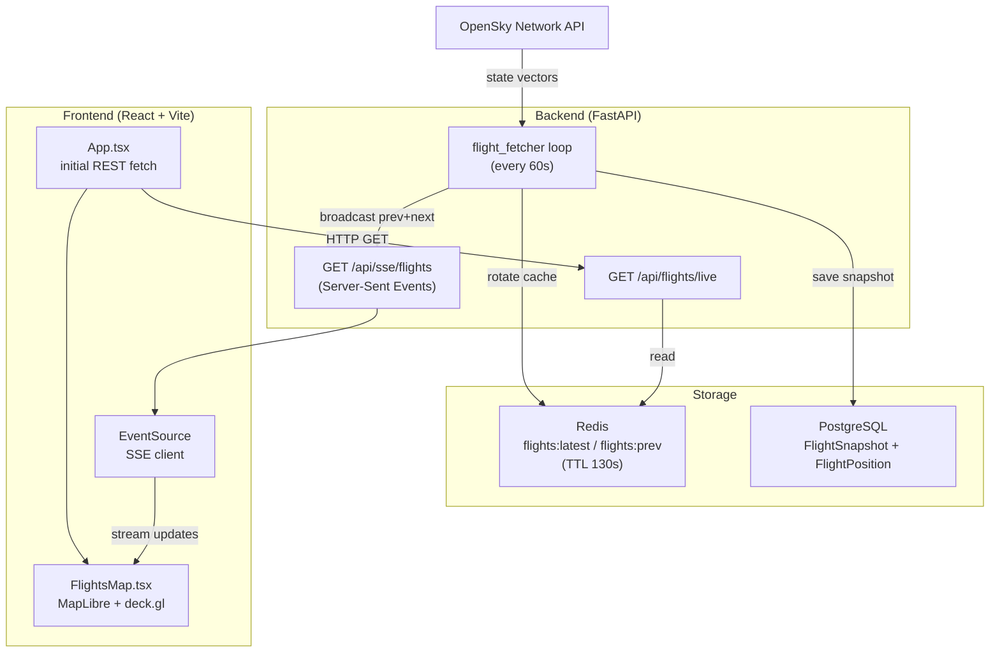

# Flight Scope

<div align="center">
  
</div>


Real-time flight tracker that visualises live aircraft positions on an interactive map, with smooth interpolated movement between polling cycles.

**Live:** [flights.spryszynski.pl](https://flights.spryszynski.pl)

---

<div align="center">
  
</div>
<div align="center">
  
</div>

---

## Tech Stack


---

## Architecture



---

## Features

- **Live aircraft positions** sourced from [OpenSky Network](https://opensky-network.org/) at a configurable interval (default: 120 seconds, controlled by `FLIGHT_FETCH_INTERVAL_SECONDS`)
- **Smooth interpolation** — frontend animates each plane between the previous and current position using `prev`/`next` payloads delivered over SSE
- **Dual rendering modes**
  - Globe view (zoom < 5): DOM markers via `react-map-gl`, capped at ~520 planes with spatial grid sampling
  - Mercator view (zoom ≥ 5): GPU-accelerated `deck.gl` `IconLayer`, up to 800 planes
- **3D model** for selected aircraft — `deck.gl` `ScenegraphLayer` rendering a GLTF Airbus A319 model
- **Computed heading** — bearing is derived from successive Redis-cached positions rather than relying solely on OpenSky's `true_track` field
- **Flight history panel** — replay past snapshots stored in PostgreSQL
- **Stale data indication** — UI flags when OpenSky returns no data and the backend falls back to the last DB snapshot
- **Automatic downsampling** — snapshots older than 24 hours are thinned to one per 5-minute window, run every hour
- **Rate-limit backoff** — fetcher detects OpenSky rate limits and backs off for 5 minutes automatically

---

## Getting Started

### Prerequisites

- Docker + Docker Compose
- OpenSky Network account (free) — [register here](https://opensky-network.org/index.php?option=com_users&view=registration)
- MapTiler account (free tier sufficient) — [register here](https://www.maptiler.com/)

### 1. Clone the repo

```bash
git clone https://github.com/wiktorspryszynski/flight-scope.git
cd flight-scope
```

### 2. Create `.env`

Copy the example and fill in the values:

```bash
cp .env.example .env
```

See the [Environment Variables](#environment-variables) table below for details.

### 3. Start

```bash
# Development (hot-reload frontend, no Nginx)
docker compose --profile dev up --build

# Production-like (pre-built frontend served by Nginx)
docker compose --profile prod up --build
```

The app is available at `http://localhost:5173` (dev) or via Nginx on `http://localhost` (prod, requires Nginx config).

The backend API is at `http://localhost:8000`.

> **Dummy data mode:** set `DEV_DUMMY_DATA=true` in `.env` to skip OpenSky entirely and use a static fixture — useful for UI development without credentials.

---

## Environment Variables

| Variable | Required | Default | Description |
|---|---|---|---|
| `OPENSKY_CLIENT_ID` | Yes* | — | OpenSky OAuth2 client ID |
| `OPENSKY_CLIENT_SECRET` | Yes* | — | OpenSky OAuth2 client secret |
| `POSTGRES_USER` | Yes | — | PostgreSQL username |
| `POSTGRES_PASSWORD` | Yes | — | PostgreSQL password |
| `POSTGRES_DB` | Yes | — | PostgreSQL database name |
| `REDIS_HOST` | No | `redis` | Redis hostname (matches Compose service name) |
| `REDIS_PORT` | No | `6379` | Redis port |
| `REDIS_DB` | No | `0` | Redis database index |
| `FLIGHT_POSITION_TTL_SECONDS` | No | `300` | TTL for per-aircraft heading cache in Redis |
| `FLIGHT_FETCH_INTERVAL_SECONDS` | No | `120` | Backend fetcher loop interval (seconds) |
| `VITE_API_BASE_URL` | Yes | — | Backend URL visible to the browser, e.g. `http://localhost:8000` |
| `VITE_MAPTILER_KEY` | Yes | — | MapTiler API key for map tiles |
| `VITE_FLIGHT_FETCH_INTERVAL_SECONDS` | No | `120` | Baked into the frontend bundle; controls SSE timeout and animation duration — keep in sync with `FLIGHT_FETCH_INTERVAL_SECONDS` |
| `DEV_DUMMY_DATA` | No | `false` | Set to `true` to serve static dummy flights instead of calling OpenSky |

\* Not required when `DEV_DUMMY_DATA=true`.

---

## Decisions & Tradeoffs

### FastAPI over Flask / Django

The entire data path is I/O-bound: waiting on OpenSky's API, Redis reads, and SSE streaming. FastAPI's async-first model lets the background fetcher, inbound SSE connections, and REST requests share one event loop without threading overhead. Django would add ORM and middleware weight that buys nothing here; Flask would require bolting on async support manually.

### Redis as the primary read path for `/api/flights/live`

OpenSky enforces strict per-IP rate limits. A cache-aside pattern on the REST endpoint means every browser refresh doesn't count against the quota. The 130-second TTL on `flights:latest` is intentionally longer than the 60-second fetch interval — if the fetcher misses one cycle the endpoint still serves data rather than hitting OpenSky directly or returning an error.

### SSE over WebSockets for real-time updates

The update stream is strictly server-to-client: the browser never pushes data back. SSE is simpler to implement, works over plain HTTP/1.1, and requires no special handling when proxied through Nginx (`proxy_buffering off` is sufficient). The connection manager uses a per-client `asyncio.Queue(maxsize=2)` which drops stale frames automatically if a client falls behind — relevant when the animation cycle is longer than the fetch interval.

### PostgreSQL for snapshot history

Flight positions are append-only time-series writes, which PostgreSQL handles well enough at this scale. The 24-hour downsampling to 5-minute windows keeps the table size bounded without a dedicated time-series database. A proper TSDB (TimescaleDB, InfluxDB) would be the right call if query patterns or write volume grew significantly.

### Docker Compose over bare-metal deployment

All four services (backend, frontend, Postgres, Redis) are pinned to specific image versions and started in dependency order with health checks. This removes environment drift between local development and the VPS. The `prod` and `dev` profiles split the frontend build so the production image is a pre-compiled Nginx-served bundle while development mounts the source with hot reload.

---

## CI/CD

Two workflows under `.github/workflows/`:

**`pr_test.yml`** — runs on every pull request targeting `main`:
- Backend: installs Python 3.12 dependencies, runs `pytest tests/`
- Frontend: installs Node 22 dependencies, runs `tsc --noEmit` and `eslint`
- Docker: validates `docker compose config` with a stub `.env`

**`deploy.yml`** — runs on push to `main`:
- SSHes into the OVH VPS on a non-standard port
- Runs `git pull origin main && docker-compose up --build -d`
- Credentials (host, user, SSH key, deploy path) are stored as GitHub Actions secrets

---

## Project Structure

```
flight-scope/
├── backend/
│   └── app/
│       ├── main.py              # FastAPI app, lifespan, CORS, router registration
│       ├── api/                 # Route handlers (flights, SSE, aircraft, stats)
│       ├── tasks/
│       │   └── flight_fetcher.py  # Background loop
│       ├── services/            # OpenSky client, Redis cache, heading, broadcast, DB
│       ├── models/              # SQLAlchemy ORM models
│       └── schemas/             # Pydantic models
├── frontend/
│   └── src/
│       ├── App.tsx
│       ├── modules/             # FlightsMap, FlightInfoCard, PlaneScenegraphLayer, …
│       └── types/
├── docker-compose.yml
├── docker-compose.override.yml
└── .github/workflows/
```

---

## Data Source

Flight data is provided by the [OpenSky Network](https://opensky-network.org/), a community-driven project offering free access to live ADS-B state vectors.